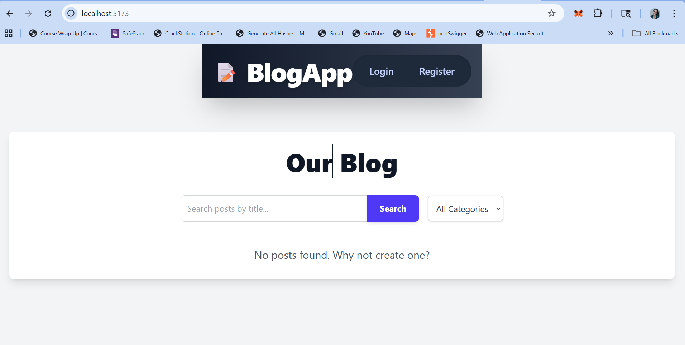
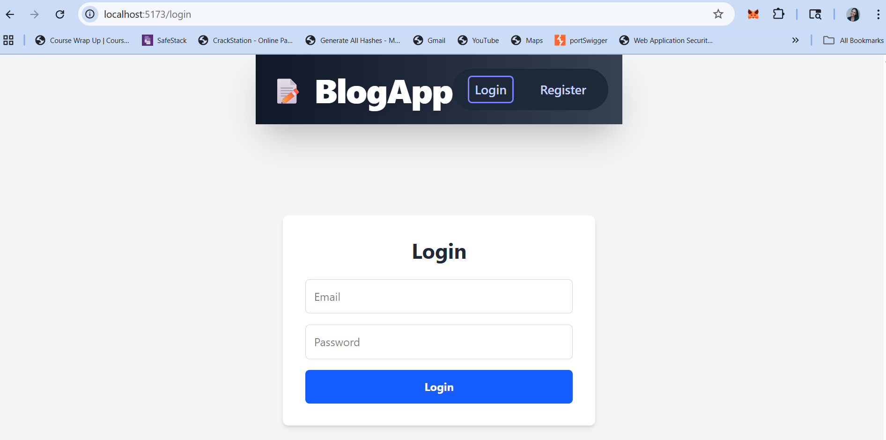
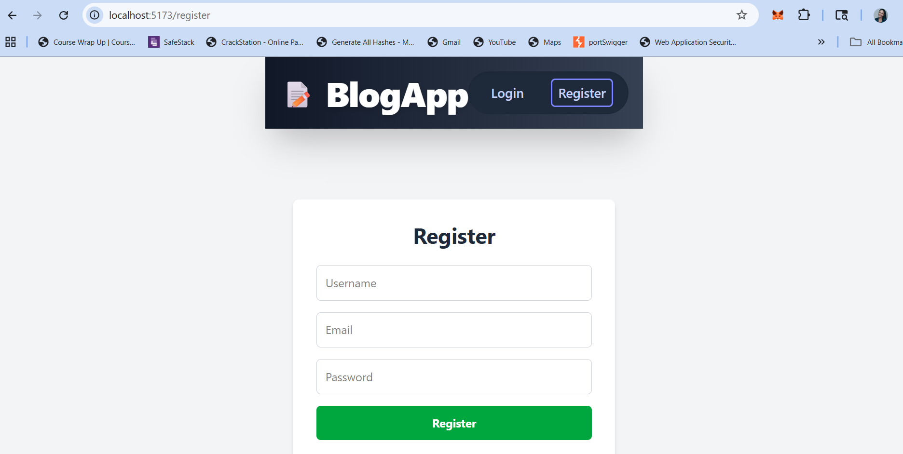

# MERN Stack Blog Application

This assignment focuses on building a full-stack MERN (MongoDB, Express.js, React.js, Node.js) application that demonstrates seamless integration between front-end and back-end components.

## Table of Contents

- [Project Overview](#project-overview)
- [Features Implemented](#features-implemented)
- [API Documentation](#api-documentation)
  - [Authentication Endpoints](#authentication-endpoints)
  - [Post Endpoints](#post-endpoints)
  - [Category Endpoints](#category-endpoints)
- [Setup Instructions](#setup-instructions)
- [Technologies Used](#technologies-used)
- [Screenshots](#screenshots) (Placeholder - Add your own screenshots here!)

## Project Overview

This application serves as a solution to a MERN stack assignment, demonstrating proper integration between MongoDB, Express.js, React.js, and Node.js. It features a robust backend API and a dynamic React frontend, offering a complete blog experience.

## Features Implemented

The application implements the following features:
### 🔒 Authentication
- User registration and login using JWT.
- Passwords hashed using bcrypt.
- Protected routes for creating, editing, and deleting posts.

### 📝 Blog Posts
- Create, read, update, and delete blog posts.
- Add featured images.
- Add and view comments on each post.

### 🏷️ Categories
- Create categories.
- View posts by category.

### 💬 Comments
- Add comments to posts (authenticated users only).
- Optimistic UI updates for comments for a better user experience.

### Image Uploads
- Upload featured images for blog posts.

### Pagination
- Paginated display of blog posts on the list page.

### Searching and Filtering
- Search posts by title.
- Filter posts by category.

### 🌐 Technical Implementation
- Clear Directory Structure: Organized client and server directories following best practices.
- MongoDB Integration: Uses Mongoose for object data modeling.
- Express.js Backend: Robust RESTful API with necessary middleware (CORS, JSON parsing, error handling).
- React.js Frontend: Built with Vite, utilizing React Router for navigation and React Hooks for state management.
- Environment Variables: Configuration management using `.env` files.
- Input Validation: Server-side input validation using `express-validator`.
- Custom API Hook: A custom React hook (`useApi`) for efficient API calls and state management (loading, error).

## API Documentation

The backend exposes a RESTful API. All API endpoints are prefixed with `/api`.

### Authentication Endpoints

| Method | Endpoint        | Description                   | Protected | Body/Query Parameters                                     | Response Example                                                              |
| :----- | :-------------- | :---------------------------- | :-------- | :-------------------------------------------------------- | :---------------------------------------------------------------------------- |
| `POST` | `/api/auth/register` | Register a new user           | No        | `username`, `email`, `password`                           | `{ message: "Registration successful", user: { _id, username, email, ... } }` |
| `POST` | `/api/auth/login`    | Log in an existing user       | No        | `email`, `password`                                       | `{ token: "jwt_token", user: { _id, username, email, ... } }`                 |

### Post Endpoints


| Method | Endpoint                 | Description                             | Protected | Body/Query Parameters                                 | Response Example                                                                           |
| :----- | :----------------------- | :-------------------------------------- | :-------- | :---------------------------------------------------- | :----------------------------------------------------------------------------------------- |
| `GET`  | `/api/posts`             | Get all blog posts                      | No        | `page` (int), `limit` (int), `category` (id), `search` (string) | `{ posts: [...], totalPages: 5, currentPage: 1 }`                                      |
| `GET`  | `/api/posts/:id`         | Get a specific blog post by ID or slug  | No        | None                                                  | `{ _id, title, content, featuredImage, category, author, comments, ... }`                  |
| `POST` | `/api/posts`             | Create a new blog post                  | Yes       | `title`, `content`, `category`, `featuredImage` (file) | `{ _id, title, content, ... }`                                                             |
| `PUT`  | `/api/posts/:id`         | Update an existing blog post            | Yes       | `title`, `content`, `category`, `featuredImage` (file) | `{ _id, title, content, ... }`                                                             |
| `DELETE` | `/api/posts/:id`         | Delete a blog post                      | Yes       | None                                                  | `{ message: "Post deleted" }`                                                              |
| `POST` | `/api/posts/:id/comments`| Add a comment to a specific blog post   | Yes       | `content`                                             | `{ _id, title, content, comments: [...], ... }`                                            |

### Category Endpoints
### Category Endpoints

| Method | Endpoint             | Description             | Protected | Body/Query Parameters | Response Example                                     |
| :----- | :------------------- | :---------------------- | :-------- | :-------------------- | :--------------------------------------------------- |
| `GET`  | `/api/categories`    | Get all categories      | No        | None                  | `[{ _id, name, description, ... }]`                  |
| `POST` | `/api/categories`    | Create a new category   | Yes       | `name`, `description` | `{ _id, name, description, ... }`                    |

## Setup Instructions
 **Clone the repository:**
    ```bash
    git clone <your-repository-url>
    cd mern-stack-integration-Maryann878
    ```

 **Set up environment variables:**
    *   Create a `.env` file in the `server` directory and add your MongoDB URI, JWT secret, and port.
    * Create a `.env` file in the `client` directory and add API base URL:
    ```   VITE_API_BASE_URL=http://localhost:5000/api
```

**Install server dependencies:
    Server Setup
    ```bash
    cd server
    npm install
    ```

 **Install client dependencies:
    Client Setup
    ```bash
    cd client
    npm install
    ```

**Start the development servers:**
    *   In the `server` directory, run:
        ```bash
        npm run dev
        ```
    *   In a new terminal, navigate to the `client` directory and run:
        ```bash
        npm run dev
        ```

**Access the application:**
    Open your web browser and go to `http://localhost:5173` (or the address provided by Vite).

## Technologies Used

*   **Frontend:**
    *   React.js
    *   Vite
    *   React Router
    *   Axios
    *   Tailwind CSS
*   **Backend:**
    *   Node.js
    *   Express.js
    *   MongoDB
    *   Mongoose
    *   bcryptjs (for password hashing)
    *   jsonwebtoken (for authentication)
    *   multer (for file uploads)
    *   express-validator (for input validation)
    *   dotenv (for environment variables)

## Screenshots
### Home Page
<a href="client/public/homepage.png" target="_blank">
  
</a>

### Login Page
<a href="client/public/login-page.png" target="_blank">
  
</a>

### Register Page
<a href="client/public/register-page.png" target="_blank">
  
</a>


## Resources

- [MongoDB Documentation](https://docs.mongodb.com/)
- [Express.js Documentation](https://expressjs.com/)
- [React Documentation](https://react.dev/)
- [Node.js Documentation](https://nodejs.org/en/docs/)
- [Mongoose Documentation](https://mongoosejs.com/docs/) 